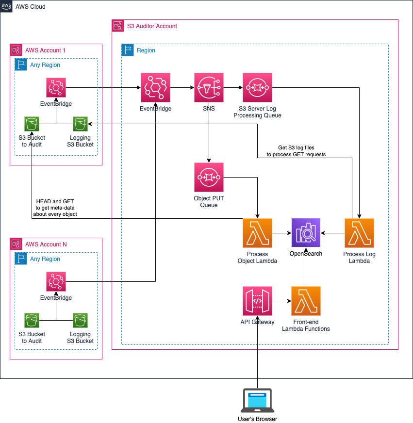

# Guidance for Enterprise Search and Audit for Amazon S3

## Overview

This solution was built to allow for meta-data search of S3 objects in multiple S3 buckets and AWS accounts. Additionally, this solution allows the users to collect GET request data information from S3 Access Logs to collate access information on an individual object basis. Meta-data stored about each object includes all S3 tags, created date, encryption status, storage layer, and more. All this information is searchable through the provided ReactJS interface but customers can access the information directly in the OpenSearch cluster included with this solution.

## Prerequisities

The only prerequisite for this solution is the proper access to run the CloudFormation template to set up S3 Auditor Lambda, SQS, SNS, IAM Permissions, OpenSearch Cluster, API Gateway and S3 permissions.

## Architecture



## Deployment

### Step 1. CloudFormation

1. Create a deployment bucket where you'll put the assets (lambda function and layer zip files) needed for the CloudFormation Deployment
2. Create an export bucket where inventory exports will go when requested by users. Users will need access this bucket to pick up their exports
3. Go to Secrets Manager in the console
   - Click on Store a new secret
   - Under secret type select Other type of secret
   - Below for key/value put in `username` for the key and any username value you’d like (e.g. admin)
   - Click Add row and put in another key/value pair with `password` as the key and whatever password you’d like for the value (must be at least 12 characters long with at least one capital, number, and symbol)
   - Click Next
   - For the secret name enter `s3auditor-opensearch-info` (this is required)
   - Click Next, click Next again, and then click Store
4. Run the CloudFormation template provided here to set up all the necessary resources needed for this solution. This step can take approximately 15 minutes or more.
5. Upon success, save the Role ARN, API Gateway endpoint, and OpenSearch Dashboard URL outputs

### Step 2. OpenSearch Setup

1. Go to the OpenSearch Dashboard URL and login with the credentials you saved in Secrets Manager
2. In the top left, click on the menu icon and go to Security
3. Select Roles and find the `all_access and security_manager` roles
   - In both of these roles, go to Mapped Users tab
   - Click on Manage Mapping
   - Add the ARN for the Role from the CloudFormation Outputs tab into the Backend roles and click Map
4. In the AWS Console, navigate to Lambda Functions and click on `s3auditor-create-os-tables-run-once`
   - Go to lambda_function.py so you can see the code of the function
   - Press Test above and create a new test event. The name can be anything you choose
   - Press Test again to execute the function to create the necessary OpenSearch indexes

### Step 3. Front-end Setup

This step is only required if you'd like to use the provided React front-end to view the information stored in OpenSearch.

1. Unzip all the React code to a directory
2. Update REACT_APP_API_GATEWAY_URL with the API Gateway output from CloudFormation
   - You will need to copy source/frontend/.env.template to source/frontend/.env
3. Get the latest modules by running `npm install`
4. Build the application via `npm run build`
5. Download the React build code from the build directory and set it up as a static site in an S3 bucket or any hosting location of your choice
   - If you want to run it locally on your machine, run `npm start`

## Adding a Bucket for S3 Auditor to Track

If this is the FIRST bucket in this AWS account to get set up for the S3 auditor continue below, otherwise skip to bucket-level details

### Account Setup

1. Go to Amazon EventBridge and go to Rules (make sure you're in the same region as your bucket)
2. Create a new Rule:
   - Give it any name and description
   - Keep the default event bus unless you’d like to set up a more custom workflow
   - For Rule Type, make sure “Rule with an event pattern” is selected for Rule Type
   - Click Next
   - For Event Source, leave it on “AWS events or EventBridge partner events”
   - Under Event Pattern > AWS Service, select Simple Storage Service (S3)
     - For Event Type, select Amazon S3 Event Notification
     - Select the following events for S3 Event Notifications:
       - Object Access Tier Changed
       - Object Created
       - Object Deleted
       - Object Restore Completed
       - Object Storage Class Changed
       - Object Tags Added
       - Object Tags Deleted
     - You can leave Any bucket selected or specify your bucket name
   - Click Next
   - For the Target, select EventBridge event bus
     - Select “Event bus in a different account or Region”
     - Add the ARN of the Event bus from your auditor account
     - You can either create a new role or use an existing one if you have one already
   - Click Next
   - Add any tags you’d like
   - Click Next and review the setup
   - Click Finish
   - In the S3 Auditor account, go to the `default` EventBridge bus and make sure your account is added as a PutEvents source
     - Go to the EventBridge event bus you specified
     - Edit the PutEvents permissions to allow for your sender account to send events

```
{
  "Version": "2012-10-17",
  "Statement": [{
    "Sid": "someId",
    "Effect": "Allow",
    "Principal": {
      "AWS": "arn:aws:iam::[YOUR SENDER AWS ACCOUNT ID]:root"
    },
    "Action": "events:PutEvents",
    "Resource": "arn:aws:events:us-east-1:[YOUR AUDITOR AWS ACCOUNT ID]:event-bus/default"
  }]
}
```

### Bucket Setup

1. Go to the bucket you’d like to add and click on Permissions tab and then go to Bucket Policy. Add the following statement to your policy:

```
{
	"Sid": "uniqueStmntId",
	"Effect": "Allow",
	"Principal": {
		"AWS": "[ARN FOR s3auditorLambdaRole from CloudFormation Output]"
	},
	"Action": "s3:GetObject*",
	"Resource": "arn:aws:s3:::[YOUR BUCKET NAME]/*"
}
```

2. Go to the bucket you'd like to add and click on Properties tab
3. Under Event Notifications, click Edit next to Amazon EventBridge and set it to On
4. In the AWS Account where your S3 Auditor is set up:
   - Go to IAM > s3auditorLambdaRole and add the following inline policy to an existing inline policy or add a new one:

```
{
    "Version": "2012-10-17",
    "Statement": [
        {
            "Sid": "someUniqueStmntId",
            "Action": "s3:GetObject*",
            "Effect": "Allow",
            "Resource": "arn:aws:s3:::[YOUR BUCKET NAME]/*"
        }
    ]
}
```

### GET Activity Logging

This optional step should only be done if you would like to set up GET request logging on the bucket you set up above. This ensures GET requests are logged in the S3 Auditor on a best-effort basis (this process depends on the server access logs from S3 which are delivered on a best-effort basis as per AWS documentation).

1. Create a bucket where the server access logs from the bucket above will go
2. It is required that this bucket start with “s3auditorlog-“ in the name
   - For example: s3auditorlog-server-access-logs-for-my-bucket
3. In the Permissions tab of this bucket, add the following statement to your policy:

```
{
	"Sid": "uniqueStmntId",
	"Effect": "Allow",
	"Principal": {
		"AWS": "[ARN FOR s3auditorLambdaRole from CloudFormation Output]"
	},
	"Action": "s3:GetObject*",
	"Resource": "arn:aws:s3:::[YOUR LOG BUCKET NAME]/*"
}
```

4. Go to the bucket you'd like to add and click on Properties tab
5. Under Event Notifications, click Edit next to Amazon EventBridge and set it to On
6. In the AWS Account where your S3 Auditor is set up:
   - Go to IAM > s3auditorLambdaRole and add the following inline policy to an existing inline policy or add a new one:

```
{
    "Version": "2012-10-17",
    "Statement": [
        {
            "Sid": "someUniqueStmntId",
            "Action": "s3:GetObject*",
            "Effect": "Allow",
            "Resource": "arn:aws:s3:::[YOUR LOG BUCKET NAME]/*"
        }
    ]
}
```

7. In the Properties tab of the bucket you managed in Bucket-Level Details above, go to Server Access Logging and click Edit
8. Click Enable for Server Access Logging
9. Click “Browse S3” and select the logging bucket you just created above and click “Choose Path”
10. Then Click “Save Changes”

## Importing Data from S3 Inventory File

If you have an existing bucket you would like to add to the S3 Auditor, you can run the process below to import existing meta-data from an S3 inventory file.

1. Go through the “Adding a Bucket for S3 Auditor to Track” steps above to add your bucket to the S3 Auditor
2. Generate an S3 inventory file for the bucket
3. On an EC2 instance or a local machine that has access to the AWS account where the S3 Auditor is running, and the necessary permissions to access SQS run the following steps:
   - run s3_inventory_file_import.py `region` `account` `inventory_file_name` `queue_name` `log_filename`
     - `region` - your region (e.g. us-east-1)
     - `account` - your AWS account number
     - `inventory_filename` - the name of your S3 inventory file you downloaded from S3
     - `queue_name` - the SQS queue name created by CloudFormation (e.g. s3auditor-object-activity)
     - `log_filename` - log filename for logging the activity from the import process
   - This will run until all the objects from the inventory file are added to the queue to be processed by S3 Auditor

## Running the Guidance

Once the CloudFormation template is complete and you've gone through the bucket and account set up above, put an object into the bucket that's part of the set up. You will shortly be able to see that object meta-data in the React front-end, if that was set up, or a record of that object meta-data in the OpenSearch cluster that's part of this solution.

## Cleanup

When you delete the CloudFormation stack for this solution, all of the components set up will be removed. Any buckets created and being audited by the system will remain untouched but their event notifications will stop working because the S3 Auditor EventBridge will have been removed. You would also manually have to delete the bucket where the Lambda function zip files are stored in your account that you referenced during the CloudFormation setup.

## Notices (optional)

Customers are responsible for making their own independent assessment of the information in this Guidance. This Guidance: (a) is for informational purposes only, (b) represents AWS current product offerings and practices, which are subject to change without notice, and (c) does not create any commitments or assurances from AWS and its affiliates, suppliers or licensors. AWS products or services are provided “as is” without warranties, representations, or conditions of any kind, whether express or implied. AWS responsibilities and liabilities to its customers are controlled by AWS agreements, and this Guidance is not part of, nor does it modify, any agreement between AWS and its customers.
